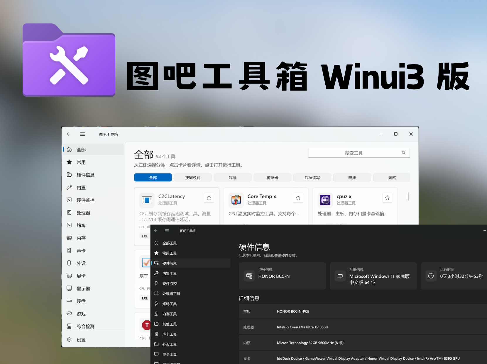

<div align="center">



# 图吧工具箱 TubaWinUi3

**图吧工具箱的重构版** -- 基于 WinUI 3 / .NET 10 全新打造

<a href="https://readme-typing-svg.demolab.com?font=Fira+Code&size=28&pause=1000&color=0078D4&center=true&vCenter=true&width=600&lines=PC+%E7%A1%AC%E4%BB%B6%E5%B7%A5%E5%85%B7%E9%9B%86%E5%90%88;WinUI+3+%C2%B7+.NET+10;82+%E6%AC%BE%E5%B7%A5%E5%85%B7+%C2%B7+%E4%B8%80%E9%94%AE%E5%90%AF%E5%8A%A8">

</a>

[](LICENSE)
[](https://dotnet.microsoft.com/)
[](https://learn.microsoft.com/windows/apps/winui/)
[](https://github.com/luolangaga/tubatool)
[](https://github.com/luolangaga/tubatool)

[官网文档](https://tubawinui3.cn) | [下载](https://github.com/luolangaga/tubatool/releases) | [反馈](https://github.com/luolangaga/tubatool/issues) | [讨论](https://github.com/luolangaga/tubatool/discussions)

</div>

---

### 交流用 QQ 群：485079194

## 为什么选择 TubaWinUi3？

> 图吧工具箱的经典工具收录 + 全新的现代体验

| 对比项 | 图吧工具箱原版 |   TubaWinUi3   |
|:------:|:-------:|:--------------:|
| UI 框架 |   易语言   | WinUI 3 原生现代界面 |
| 界面动画 |   基本无   |  流畅过渡动画与交互反馈   |
| ARM 平台 |   不支持   |   原生支持 ARM64   |
| 自动更新 |  手动下载   |  启动时自动检查，一键更新  |
| 开源 |   闭源    | 界面开源 (GPL-3.0) |
| 工具更新 | 跟随大版本发布 |  持续更新，工具版本更及时  |
| 主题 |  单一主题   | 亮色 / 暗色 / 跟随系统 |

---

## 功能亮点

<table>
<tr>
<td width="50%">

**一键启动工具**
自动扫描 `Tools/` 文件夹，按分类展示，点击即用

</td>
<td width="50%">

**实时搜索**
按名字或路径快速定位工具

</td>
</tr>
<tr>
<td width="50%">

**硬件信息**
WMI 读取 CPU、内存、显卡、硬盘、显示器等

</td>
<td width="50%">

**收藏夹**
常用工具加收藏，下次直接找

</td>
</tr>
<tr>
<td width="50%">

**管理员运行**
一键以管理员身份启动工具

</td>
<td width="50%">

**发送到桌面**
一键创建桌面快捷方式

</td>
</tr>
<tr>
<td width="50%">

**自动更新**
启动时静默检查，有新版本提醒

</td>
<td width="50%">

**主题切换**
亮色 / 暗色 / 跟随系统

</td>
</tr>
</table>

---

## 收录工具

> 共 **82 款**工具，覆盖硬件检测全场景

| 类别 | 数量 | 代表工具 |
|:----:|:----:|:--------|
| 处理器 | 9 | CPU-Z / Core Temp / Prime95 / LinX |
| 显卡 | 11 | GPU-Z / FurMark / DDU / NVFlash |
| 显示器 | 3 | 色域检测 / 屏幕测试 / UFO 测试 |
| 内存 | 7 | MemTest / TM5 / Thaiphoon / ZenTimings |
| 硬盘 | 20 | CrystalDiskMark / DiskGenius / HDTune |
| 烤鸡 | 2 | FurMark / FurMark 64 |
| 综合检测 | 5 | AIDA64 / HWiNFO / HWMonitor |
| 外设 | 7 | Keyboard Test / Mouse Rate / MouseTester |
| 其他 | 19 | Everything / Dism++ / Rufus / Ventoy |

完整工具列表详见 [官网文档](https://tubawinui3.cn)

---

## 快速开始

### 下载安装

前往 [Releases](https://github.com/luolangaga/tubatool/releases) 下载最新版本，支持以下平台：

- **x64** -- 64 位 Intel / AMD
- **x86** -- 32 位 Intel / AMD
- **ARM64** -- 高通骁龙  等 ARM 设备

提供便携版 (ZIP) 和安装版 (Inno Setup) 两种形式。

### 从源码构建

```bash
git clone https://github.com/luolangaga/tubatool.git
cd tubatool
dotnet build        # 编译
dotnet run          # 运行（Unpackaged 模式）
```

<details>
<summary>环境要求</summary>

- [.NET 10 SDK](https://dotnet.microsoft.com/download/dotnet/10.0)
- [Visual Studio 2022 17.14+](https://visualstudio.microsoft.com/) 或 [VS Code](https://code.visualstudio.com/)（配合 C# Dev Kit）
- 最低支持 Windows 10 1809
- 支持 x86 / x64 / ARM64

</details>

### 技术栈


| 技术 | 用途 |
|:----:|:----:|
| .NET 10 + WinUI 3 | UI 框架（Windows App SDK 1.8） |
| System.Management | WMI 硬件信息查询 |
| System.Drawing.Common | 图标提取 |

---

## 开发指南

> 完整开发文档请访问 [tubawinui3.cn](https://tubawinui3.cn)

### 项目结构

```
App.xaml.cs              -> 应用入口
MainWindow.xaml.cs       -> 导航框架
Pages/                   -> 页面（首页/内置工具/硬件/设置）
Services/                -> 服务层
  IBuiltinTool.cs        -> 内置工具接口
  BuiltinToolRegistry.cs -> 工具注册表
  BuiltinTools/          -> 内置工具实现
Models/                  -> 数据模型
Metadata/tools.json      -> 外部工具元数据
Tools/                   -> 第三方可执行文件
```

### 添加内置工具（4 步）

```csharp
// 1. 在 Services/BuiltinTools/ 下新建类，实现 IBuiltinTool
public sealed class MyTool : IBuiltinTool
{
    public string Id => "my-tool";
    public string Name => "我的工具";
    public string Description => "工具描述";
    public string Glyph => "\uE8E5";
    public string Category => "系统工具";
    public BuiltinToolKind Kind => BuiltinToolKind.Dialog;

    public async Task ExecuteAsync(BuiltinToolContext context) { /* ... */ }
}

// 2. 选择工具类型：Dialog / BackgroundTask / ProgressTask / InstantAction
// 3. 在 BuiltinToolRegistry.RegisterDefaults() 中注册
// 4. dotnet build && dotnet run 验证
```

<details>
<summary>工具类型说明</summary>

| 类型 | 说明 | 适用场景 |
|------|------|----------|
| `Dialog` | 弹窗式 UI | 键盘测试、端口查看 |
| `BackgroundTask` | 后台执行 | WiFi 密码查看 |
| `ProgressTask` | 带进度条 | 网速测试、电池报告 |
| `InstantAction` | 即时操作 | 刷新 DNS |

</details>

<details>
<summary>添加外部工具</summary>

1. 放入对应分类文件夹（如 `Tools/硬盘工具/CrystalDiskMark/`）
2. 支持类型：`.exe` `.bat` `.cmd` `.lnk` `.msc` `.ps1` `.vbs`
3. （可选）在 `Metadata/tools.json` 添加描述和下载链接

</details>

<details>
<summary>Git 协作流程</summary>

```bash
git clone <仓库地址> && cd tubatool
git checkout -b feature/xxx
git add <文件> && git commit -m "feat: 添加xxx"
git push origin feature/xxx          # 然后创建 PR
```

提交格式：`feat:` 新功能 / `fix:` 修复 / `docs:` 文档 / `refactor:` 重构

> 提交前确保 `dotnet build` 通过，不要提交 `bin/` `obj/` `.pfx` `.cer`

</details>

更多开发细节 -> [tubawinui3.cn](https://tubawinui3.cn)

---

## 支持与捐赠

如果 TubaWinUi3 对你有帮助，欢迎支持项目的持续开发 ❤️

<div align="center">
  
  <br/>
  <sub>扫描二维码支持作者</sub>
</div>

---

## 致谢

- [Windows App SDK (WinUI 3)](https://github.com/microsoft/WindowsAppSDK)
- [Win2D](https://github.com/microsoft/Win2D)
- 所有收录工具的开发者

### 贡献者

<a href="https://github.com/luolangaga/tubatool/graphs/contributors">
  
</a>

---

<div align="center">


<a href="https://www.star-history.com/?repos=luolangaga%2Ftubatool&type=date&legend=bottom-right">
  <picture>
    <source media="(prefers-color-scheme: dark)" srcset="https://api.star-history.com/chart?repos=luolangaga/tubatool&type=date&theme=dark&legend=bottom-right" />
    <source media="(prefers-color-scheme: light)" srcset="https://api.star-history.com/chart?repos=luolangaga/tubatool&type=date&legend=bottom-right" />
    
  </picture>
</a>

**如果觉得有用，给个 Star 吧！**

</div>
