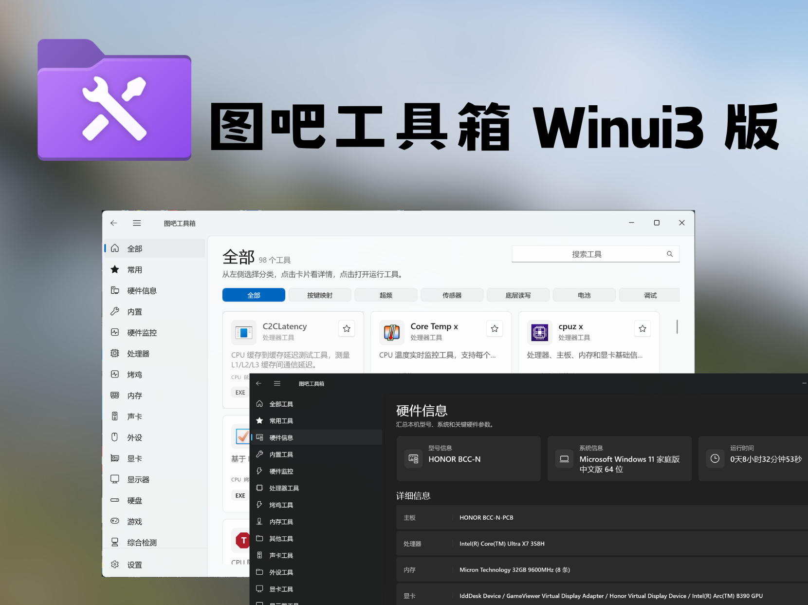

<div align="center">

[English](README_EN.md) | 中文



# 图吧工具箱CE TubaWinUi3

**图吧工具箱的社区重构版（Community Edition）** -- 基于 WinUI 3 / .NET 10 全新打造

<a href="https://readme-typing-svg.demolab.com?font=Fira+Code&size=28&pause=1000&color=0078D4&center=true&vCenter=true&width=600&lines=PC+%E7%A1%AC%E4%BB%B6%E5%B7%A5%E5%85%B7%E9%9B%86%E5%90%88;WinUI+3+%C2%B7+.NET+10;82+%E6%AC%BE%E6%94%B6%E5%BD%95%E5%B7%A5%E5%85%B7+%2B+45+%E6%AC%BE%E5%86%85%E7%BD%AE%E5%B7%A5%E5%85%B7;%E4%B8%80%E9%94%AE%E5%90%AF%E5%8A%A8">

</a>

[](LICENSE)
[](https://dotnet.microsoft.com/)
[](https://learn.microsoft.com/windows/apps/winui/)
[](https://github.com/luolangaga/tubatool)
[](https://gitcode.com/luolangaga/tubatool)
[](https://github.com/luolangaga/tubatool)

<a href="https://atomgit.com/luolangaga/tubatool"></a>
<a href="https://trendshift.io/repositories/51042?utm_source=trendshift-badge&utm_medium=badge&utm_campaign=badge-trendshift-51042" target="_blank" rel="noopener noreferrer"></a>
<a href="https://trendshift.io/repositories/51042?utm_source=trendshift-badge&utm_medium=badge&utm_campaign=badge-trendshift-51042" target="_blank" rel="noopener noreferrer"></a>

[官网文档](https://tubawinui3.cn) | [下载](https://github.com/luolangaga/tubatool/releases) | [反馈](https://github.com/luolangaga/tubatool/issues) | [讨论](https://github.com/luolangaga/tubatool/discussions)


</div>

> [!WARNING]
> 近期有许多非官方下载渠道，请注意甄别风险！请仅通过本文档「[安装方式](#安装方式)」列出的官方渠道下载。

---

## AtomGit G-Star 毕业项目

本项目已通过 [AtomGit](https://atomgit.com) 官方评审，获得 **G-Star 项目毕业认证**（编号 No.0614，2026.07.24），感谢 AtomGit 对图吧工具箱CE开源生态贡献的认可。

欢迎在 AtomGit 上关注我们：**[atomgit.com/luolangaga/tubatool](https://atomgit.com/luolangaga/tubatool)**

<div align="center">


</div>

---

## 目录

- [AtomGit G-Star 毕业项目](#atomgit-g-star-毕业项目)
- [功能亮点](#功能亮点)
- [内置工具](#内置工具)
- [收录工具](#收录工具)
- [安装方式](#安装方式)
- [系统兼容性](#系统兼容性)
- [从源码构建](#从源码构建)
- [交流群聊](#交流群聊)
- [贡献者](#贡献者)
- [许可证](#许可证)
- [捐赠支持](#捐赠支持)

---

## 功能亮点

<table>
<tr>
<td width="50%">

**一键启动工具**
自动扫描 `Tools/` 文件夹，按分类展示，点击即用，支持实时搜索

</td>
<td width="50%">

**硬件信息与实时监控**
CPU / GPU / 内存 / 硬盘温度、频率、功耗实时监测

</td>
</tr>
<tr>
<td width="50%">

**AI 助手**
内置智能系统代理，可诊断问题、优化配置、读写文件、执行命令

</td>
<td width="50%">

**格式转换**
图片 / 音视频 / Word / Excel / PPT / PDF 互转，OCR 识别、PDF 合并拆分

</td>
</tr>
<tr>
<td width="50%">

**游戏监控**
可自定义布局的 FPS / 温度 / 负载监控悬浮层，游戏中实时显示，支持勾选指标记录并导出 JSON / Markdown / CSV 报告；配套「记录查看」可图表化回放历史记录

</td>
<td width="50%">

**垃圾清理**
基于 Winapp2 规则库深度清理应用缓存、临时文件与注册表残留

</td>
</tr>
<tr>
<td width="50%">

**性能测试与跑分**
CPU / GPU 烤机跑分，导出 PDF 报告，社区云端排行榜对比

</td>
<td width="50%">

**常用功能齐备**
收藏夹 / 管理员运行 / 发送到桌面 / 自动更新 / 亮暗主题切换

</td>
</tr>
</table>

---

## 内置工具

> 采用 Fluent Design 构建的原生工具体系，无需依赖第三方软件

共 **45 款**内置工具，覆盖系统优化、硬件检测、网络诊断、游戏增强等场景：

| 分类 | 数量 | 代表工具 |
|:----:|:----:|:---------|
| **系统工具** | 16 | 垃圾清理 / AI 助手 / 流氓软件的克星 / 启动项管理 / 恶意软件拦截器 |
| **硬件工具** | 14 | 性能测试 / 快速验机 / 磁盘健康 / 一键三烤 / 格式转换 |
| **网络工具** | 8 | 网速测试 / 局域网文件分享 / 流量监控器 / 网络优化 |
| **游戏工具** | 4 | 游戏监控 / 记录查看 / 运行库修复 / 游戏防晕3D |
| **实用工具** | 4 | 电脑使用教程 / 常用官网 / 服务网点查询 / 社区工具 |

<details>
<summary>点击展开完整工具列表</summary>

### 系统工具
- **AI 助手** - 智能系统代理，可诊断问题、优化配置、读写文件、执行命令、联网搜索
- **恶意软件拦截器** - 将软件厂商证书加入系统不信任列表，阻止流氓软件安装和运行
- **恶意软件沙盒** - Sandboxie-Plus 沙盒环境，安全运行分析可疑程序，删除沙盒即可还原系统
- **流氓软件的克星** - 扫描清理流氓右键菜单、自启动、计划任务、服务、浏览器插件和文件关联残留
- **垃圾清理** - 基于 Winapp2 规则库扫描并清理应用缓存、临时文件与注册表残留
- **启动项管理** - 扫描开机自启动项目（注册表 Run / 启动文件夹 / 计划任务 / 服务），快速定位异常
- **右键菜单管理** - 管理 Windows 右键菜单项，支持启用 / 禁用 / 编辑 / 添加 / 删除
- **OptimizerDuck 优化鸭** - 开源 Windows 系统优化工具：系统清理、性能优化、隐私保护
- **后台节流省电神器** - 基于 Windows 11 效率模式（EcoQoS）节流后台进程，省电降温
- **配置修改器** - 修改注册表中的 CPU、GPU、系统等硬件信息显示，支持一键恢复
- **.NET 环境补全** - 检测并一键下载安装缺失的 .NET Runtime / SDK / Framework
- **Windows 隐藏功能** - 查询、启用、禁用、重置 Windows 实验性功能开关
- **Windows 镜像** - 下载 Windows 原版系统镜像（ISO / ESD），支持 ESD 转 ISO
- **正版软件商店** - 基于 WinGet 软件源浏览并安装正版软件
- **UniGetUI 包管理器** - 开源包管理器 GUI，支持 winget / scoop / chocolatey / pip / npm
- **电子文盲测试** - 25 道选择题测试你的电脑基础知识水平

### 硬件工具
- **性能测试** - 全面测试 CPU / GPU / 内存 / 硬盘 / 浏览器性能，计算游戏与办公评分，导出 PDF 报告
- **跑分排行** - 上传测试报告到社区，查看全球排行榜，与同硬件用户对比性能
- **硬件评分** - 为笔记本或台式机硬件打分，查看社区排行榜对比评价
- **快速验机** - 新电脑验机向导：外观检查、硬件信息、硬盘通电、屏幕坏点、外设、摄像头、音频一站式完成
- **磁盘健康** - SMART 健康度检测：温度 / 通电 / 寿命 / 读写量，支持 SSD TRIM 与机械盘碎片整理
- **电池消耗分析** - 分析电池消耗趋势与应用耗电排行
- **键盘测试** - 按键高亮检测，大小键盘布局切换，区分左右 Shift / Ctrl / Alt
- **屏幕坏点检测** - 全屏播放纯色与检测图案，快速发现坏点、漏光、色阶问题
- **CPU 天梯图** - 桌面 / 笔记本 CPU 性能天梯图，支持品牌筛选与排序（数据来自 NanoReview）
- **GPU 天梯图** - 桌面 / 笔记本 GPU 性能天梯图，支持品牌筛选与排序（数据来自 NanoReview）
- **核间延迟查询** - 查看社区上传的核间延迟热力图，对比不同 CPU 的核心间通信延迟
- **一键三烤** - CPU / GPU / 网卡自由勾选烤机，实时监控温度、频率、功耗
- **毒蘑菇测试** - GPU 分形压力测试，轻松 / 中等 / 变态三档压力，实时帧率监控
- **格式转换** - 图片 / 音视频 / Word / Excel / PPT / PDF / 文本互转，OCR 识别、PDF 合并拆分、打包 ZIP

### 网络工具
- **网速测试** - 原生测试延迟、下载与上传速度，多测速节点切换
- **WiFi 密码** - 查看本机已连接过的 WiFi 网络名称和密码
- **端口占用** - 查看系统所有 TCP / UDP 端口占用情况，定位占用进程
- **Hosts 编辑** - 可视化编辑系统 Hosts 文件，支持启用 / 禁用规则和 DNS 刷新
- **网络调度器** - 汇聚多网络适配器，智能分配流量，Wi-Fi 有线自动加速
- **网络优化** - TCP 参数优化、DNS 延迟测速与配置、公网 IP 查询、网络重置与 DHCP 修复
- **流量监控器** - 实时查看各连接流量、速度与延迟，支持快照录制与回放
- **局域网文件分享** - 局域网内创建 HTTP 文件分享服务，其他设备浏览器直接访问，支持拖拽上传

### 游戏工具
- **游戏监控** - 可拖拽设计布局的监控覆盖层，游戏中实时显示 FPS、温度、负载等硬件参数；可勾选指标记录数据（最长 2 小时），结束后一次性导出 JSON / Markdown / CSV 报告
- **记录查看** - 解析游戏监控导出的 JSON / CSV 记录，用原生图表回放 FPS、温度、负载等历史数据，支持分组切换、区间裁剪、归一化对比与 P1/P99 统计
- **运行库修复** - 一键修复缺失的 Visual C++ 2008-2026、.NET Framework、DirectX 旧版游戏组件
- **游戏防晕3D** - 屏幕中央准星 + 四边标记辅助，缓解 3D 眩晕

### 实用工具
- **社区工具** - 社区贡献的工具插件，下载安装即用（仅免安装版提供）
- **电脑使用教程** - 新电脑开箱指南、基础操作、烤机检测、常识与辟谣
- **常用官网** - Steam、Epic、UU 加速器等常用软件官方网站一键直达
- **服务网点查询** - 查询各大品牌笔记本、台式机官方服务网点地址

</details>

---

## 收录工具

> 共 **82 款**第三方工具，覆盖硬件检测全场景，一键启动无需安装

| 类别 | 数量 | 代表工具 |
|:----:|:----:|:--------|
| 处理器 | 9 | CPU-Z / Core Temp / Prime95 / LinX |
| 显卡 | 11 | GPU-Z / FurMark / DDU / NVFlash |
| 显示器 | 3 | 色域检测 / 屏幕测试 / UFO 测试 |
| 内存 | 7 | MemTest / TM5 / Thaiphoon / ZenTimings |
| 硬盘 | 20 | CrystalDiskMark / DiskGenius / HDTune |
| 烤鸡 | 2 | FurMark / FurMark 64 |
| 综合检测 | 5 | AIDA64 / HWiNFO / HWMonitor |
| 外设 | 7 | Keyboard Test / Mouse Rate / MouseTester |
| 其他 | 19 | Everything / Dism++ / Rufus / Ventoy |

完整工具列表详见 [官网文档](https://tubawinui3.cn)

---

## 安装方式

### GitHub Releases（推荐）

前往 [Releases](https://github.com/luolangaga/tubatool/releases) 下载最新版本。

提供两种形式：
- **便携版 (ZIP)** -- 解压即用，无需安装
- **安装版 (Inno Setup)** -- 传统安装程序

### GitCode Releases（国内镜像）

国内用户可从 [GitCode 镜像](https://gitcode.com/luolangaga/tubatool) 下载，速度更快。

### Winget（Windows 包管理器）

```powershell
winget install luolangaga.tubatools
```

### Scoop（Windows 包管理器）

```powershell
# 1. 添加图吧工具箱CE bucket
scoop bucket add tubatools https://github.com/luolangaga/scoop-tubatools

# 2. 安装（自动根据系统架构选择 x64 / arm64 便携版）
scoop install tubatools/tubatool
```

更新到最新版：`scoop update tubatool`

> 图吧工具箱CE的 Scoop 源仓库：[luolangaga/scoop-tubatools](https://github.com/luolangaga/scoop-tubatools)

### Microsoft Store（微软商店）

<a href="https://apps.microsoft.com/detail/9P15095X7MGB?referrer=appbadge&mode=full" target="_blank" rel="noopener noreferrer">
	
</a>

---

## 系统兼容性

| 平台 | 支持状态 |
|:----:|:--------:|
| x64 (Intel/AMD 64位) | ✅ 完全支持 |
| x86 (Intel/AMD 32位) | ✅ 完全支持 |
| ARM64 (高通骁龙等) | ✅ 原生支持 |

| Windows 版本 | 支持状态 |
|:------------:|:--------:|
| Windows 11 | ✅ 完全支持 |
| Windows 10 21H2+ | ✅ 完全支持 |
| Windows 10 1809+ | ✅ 最低支持 |

---

## 从源码构建

```bash
git clone https://github.com/luolangaga/tubatool.git
cd tubatool
dotnet build        # 编译
dotnet run          # 运行（Unpackaged 模式）
```

<details>
<summary>环境要求</summary>

- [.NET 10 SDK](https://dotnet.microsoft.com/download/dotnet/10.0)
- [Visual Studio 2022 17.14+](https://visualstudio.microsoft.com/) 或 [VS Code](https://code.visualstudio.com/)（配合 C# Dev Kit）
- 最低支持 Windows 10 1809
- 支持 x86 / x64 / ARM64

</details>

---

## 交流群聊

欢迎加入 QQ 群交流讨论：**485079194**

---

## 贡献者

感谢所有为本项目做出贡献的开发者！

<a href="https://github.com/luolangaga/tubatool/graphs/contributors">
  
</a>

---

## 许可证

本项目采用 **GPL-3.0** 开源协议。

- 源代码可自由使用、修改和分发
- 衍生作品必须以相同协议开源
- 详见 [LICENSE](LICENSE)；附带的 [License.txt](License.txt) 为软件使用须知与网络/隐私声明，不构成对 GPL-3.0 的附加限制

---

<div align="center">


<a href="https://star-history.com/#luolangaga/tubatool&type=date&legend=bottom-right">
  <picture>
    <source media="(prefers-color-scheme: dark)" srcset="https://api.star-history.com/svg?repos=luolangaga/tubatool&type=date&theme=dark&legend=bottom-right" />
    <source media="(prefers-color-scheme: light)" srcset="https://api.star-history.com/svg?repos=luolangaga/tubatool&type=date&legend=bottom-right" />
    
  </picture>
</a>

**如果觉得有用，给个 Star 吧！**

</div>

---

## 捐赠支持

如果这个工具箱对你有帮助，欢迎请我喝杯奶茶 ☕ 感谢每一位支持者！

<div align="center">


</div>
